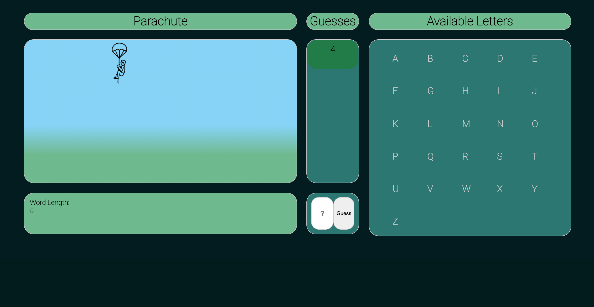
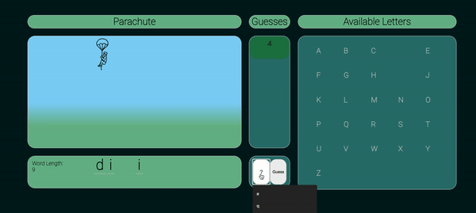

# Parachute-Game

 Functionally, Parachute is the same thing as Spaceman however instead of building a spaceship upon incorrect guesses, a parachuter descends to the ground. Parachute is a game best played with two people. The goal of the game is to guess the letters of your oppenents inputted word before making too many incorrect guesses. If too many incorrect guesses are made, the parachuter reaches the ground, and the guessing player loses.

 # Visuals

### Still

### GIF

 # Technologies Used
  - HTML
  - CSS
  - JavaScript

 # User Stories

- As a player, I want to be able to enter a word for my oppenent to guess.
- As a player, I want to be able to guess letters for the word so that I can play the game. 
- As a player, I would like to see how many guesses I have left so I know how careful to be.
- As a player, I should be able to see what letters I have not guessed yet so I do not make a mistake.
- As a player, I should be able to see what letters I have guessed correctly so I can make more educated guesses.
- As a player, I would like to be notified when I have won or lost so I know the game is over.
- As a player, I should be able to click a button to play again when the game has ended.
- As a player, I would like to see the parachute figure move when I guess incorrectly.

 # Wireframes

 # Hurdles

 ### Scope
 Scope was a hurdle for me in the beginning of this project. Going in and out of functions and trying to carry data down through them led to a lot of head scratching and refactoring. Ultimately, I started setting variables with a global scope to help with this. 

 ### Win Condition
The win condition was a hurdle and something I spent a bit of time on. I struggled with accounting for multiple occurences of the same letter in a word (ex: 'l' in 'hello'). The fix ended up being pretty simple (once I addressed my issues with scope), I created `checkArray` and replaced the values then checked with an `array.every()`.

### Node List vs Array
This stumped for awhile. A node list looks like an array and is an array like object, but you cannot do everything to a node list that you can with an array. So, with a NodeList you cannot user higher-order functions like `array.forEach()`. While going through, I learned you could make an array from a NodeList using something like `let newArray = Array.from(NodeList)`.

------------

Ultimately, the biggest tool that helped me through all hurdles, even smaller ones not mentioned above, was `console.log() `until I could find what I needed.